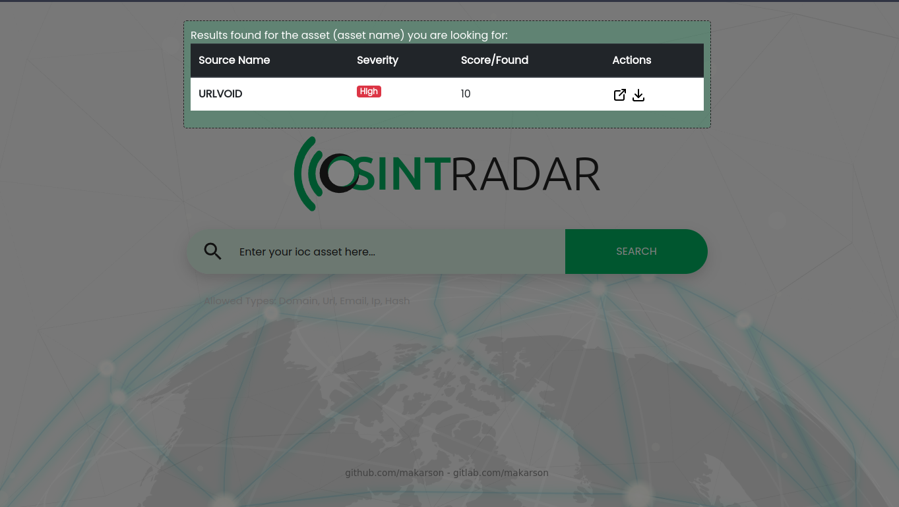

    
# OSINTRADAR PROJECT

**Osintradar Project** communicates with the API ends of many security tools broadcasting on the internet and provides summary information from a single point.

## Screenshots



  


  
## Used Technologies

**FrontEnd:** Bootstrap

**Backend:** Python, Flask, Flask Async

  
## Quick Start & Install

Clone the osintradar repository

```bash
  git clone https://github.com/makarson/osintradar-ui.git
```

or

```bash
  git clone https://gitlab.com/makarson/osintradar-ui.git
```

Go to the project folder and run installation steps

```bash
  cd osintradar-ui
  pip install virtualenv
  python3 -m venv env
  source env/bin/activate
  pip install -r requirements.txt
  flask run --host=0.0.0.0 --port=5000
```


  
## API ENDPOINTS

```http
  POST /api/search
  
  Args: keyword:str (form body)
```

| Parameter | Type     | Description                                    |
|:----------|:---------|:-----------------------------------------------|
| `keyword` | `string` | **required**. (Allowed Types: domain,url,ipv4) |


  
## Examples for SDK without interface

```shell
pip install osintradar
```
#### Using

```python
from osintradar import osintradar

response = osintradar('test.com')
print(response)
```

#### Example Output

```JSON
[
   {
      "source":"phishstats",
      "result":"malicious"
   },
   {
      "source":"phishing.database",
      "result":"clean"
   },
   {
      "source":"tweetfeed",
      "result":"clean"
   },
   {
      "source":"feodotracker",
      "result":"clean"
   },
   {
      "source":"sslblacklist",
      "result":"clean"
   },
   {
      "source":"c2intelfeeds",
      "result":"clean"
   }
]
```


### Supported Sources For URL
- vxvault
- phishunt
- openphish
- usom
- phishingdatabase
- threatview
- urlhaus
- phishstats
- tweetfeed

### Supported Sources For DOMAIN
- phishingdatabase
- tweetfeed
- c2intelfeeds

### Supported Sources For IPV4
- phishstats
- phishingdatabase
- tweetfeed
- feodotracker
- sslblacklist
- c2intelfeeds

## Roadmap

- More osint tool/source entegrations
- More stable working opportunity
- Check our [to-do list](./todo.md) for more

  
## Licence

[MIT](https://choosealicense.com/licenses/mit/)

  
## Support

You can help us improve this project by forking it and reporting an issue.
  